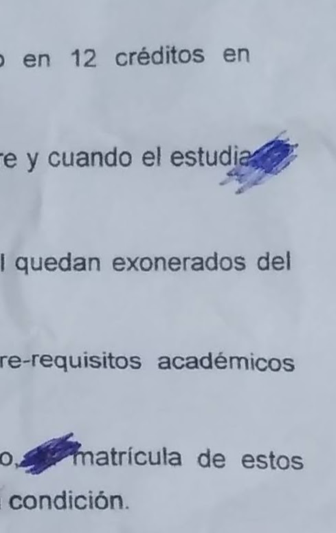
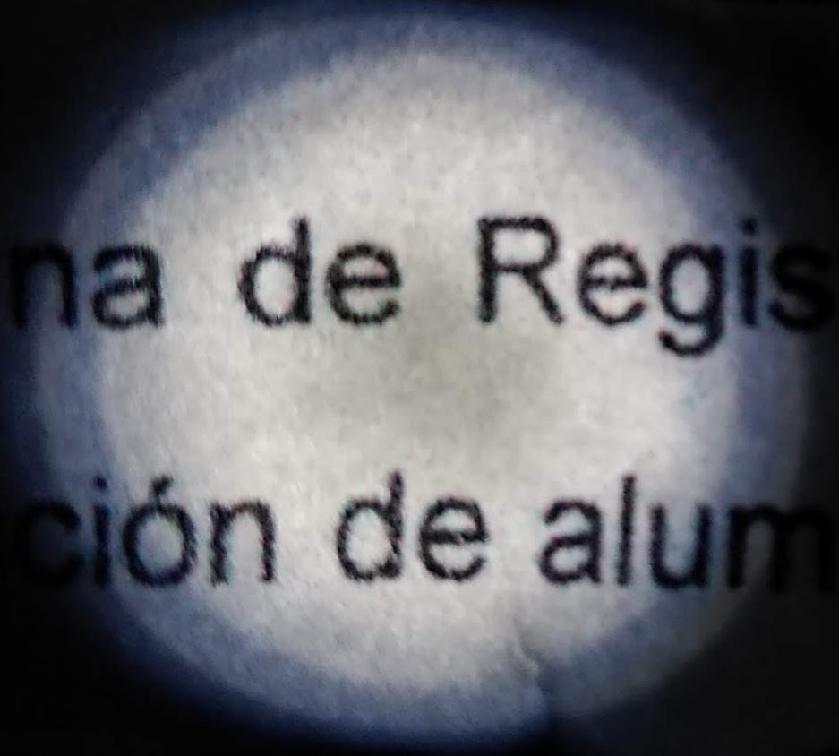
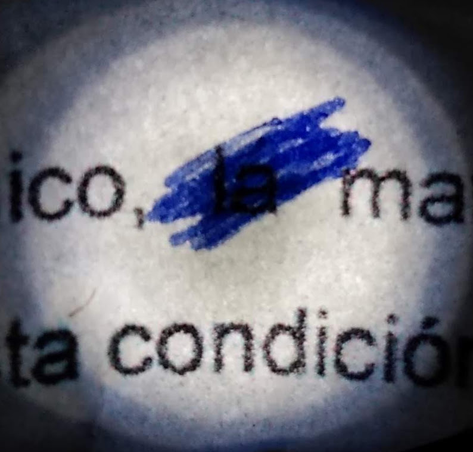
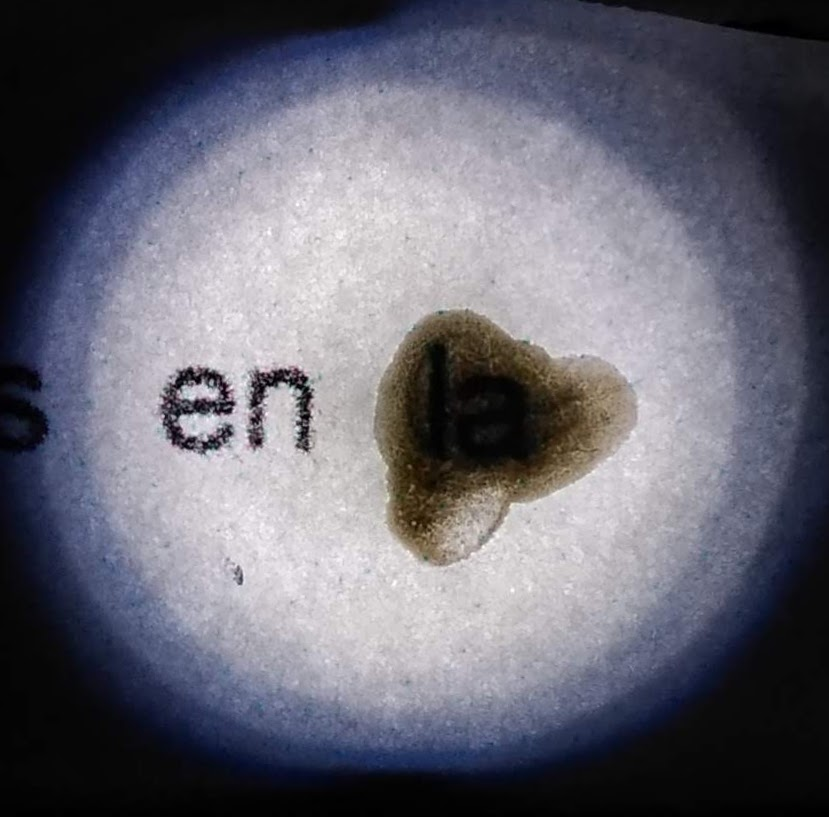
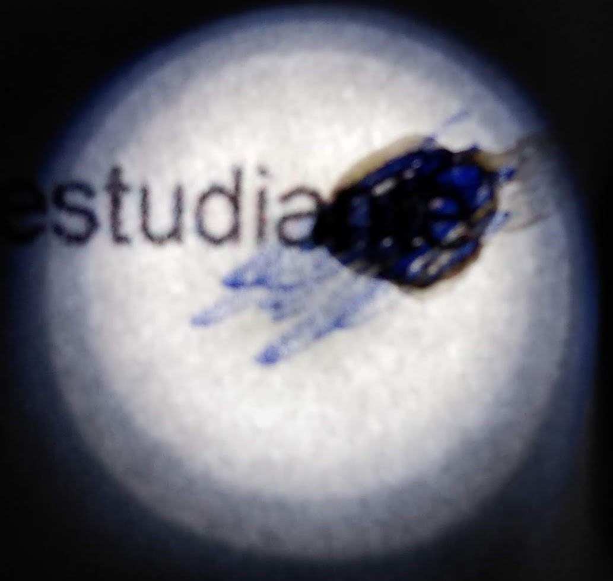

---
title:
- Inpainting, y otras tecnicas de reconstruccion de imagenes aplicado en documentos danados o censurados
author:
- Jahir Medina
- Miguel Pacheco
---

# Resumen

Inpainting *(pintando dentro de)*, es una tecnica de reconstruccion de imagenes,usado para reconstruir informacion perdida o danada en la imagen.
Algunas tecnicas reconstrucctivas, que pueden estar basadas en operaciones morfologicas y variantes de otros algoritmos seran usados para reconstruir infomacion en imagenes de docuemtnso, los cuales podrian estar danados o censurados (tachas de corrector, o manchas de tinta).

Para favorecer esta reconstruccion, se emplea una fuente de luz intensa, de manera que el documento se encuentre a contraluz; de luz blanca o de distintos colores.

# Introduccion

# Realidad Problematica

Muchos documentos, que durante el proceso de edicion tuvieron erratas y fueron posteriormente editados pueden llegar a poser danos , aun que voluntarios, excesivos.

Si bien parte de esto puede ser reconstruido reescribiendo el documento, para casos donde el documento es antiguo (cosiderese registro de notas de los anos 1970, en papel bulki y escrito a maquina) y no solo debe ser realizado en solo un documento, resulta excesivo y lento.

En grandes ficheros, donde una solucion moderna puede ser escanear documentos y aplicar un post procesamiento con algoritmos OCR, muchos elementos son omitidos:

- imagenes
- tablas
- caracteres blanqueados
- borraduras
- destinturacion de caracateres

Esto disminuye significativamente la autmoatizacion del proceso bajo tecnicas estandars, ademas de que implementar tecnicas modernas basdas en aprendizaje automatico resultaria en el rediseno de hardware ya adquirido.

# Alternativa de Solucion

- Emplear 4 luces diferentes : Blanco, Rojo, Azul, Verde.
- Usar dichas luces como fuente de luz trasera al documento

- Capturar imagenes del documento y las partes danadas especificas
- Reconstruir las partes danas especificas mediante tecnicas clasicas.
	* reduccion de ruido
	* operaciones morfologicas (eliminacion de protuberancias)
	* separacion de figura y fondo
	* segmentacion
	* inpainting (reconstruccion de las partes faltantes)
	* integracion al contexto general
- Puesta en "disponible" para su postprocesamiento mediante algoritmos OCR.

Algunos ejemplos de censuras:

---

## Tinta (Lapciero)

## Corrector (Blanco)

## Tinta sobre Corrector

---

# Marco Teorico

Placeholder

# Metodologia

Placeholder
