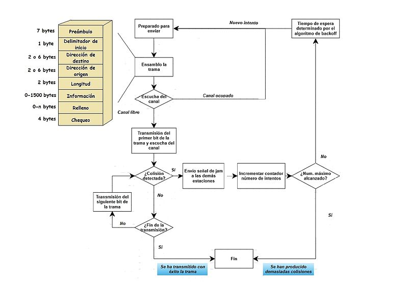

---
title:
- Técnicas de control de Acceso al Medio
author:
- Jahir Medina
theme: 
- Copenhagen
---

# Técnicas de control de Acceso al Medio

El control de acceso al medio es el equivalente a las reglas de tráfico que regulan la entrada de vehículos a una autopista. La ausencia de un control de acceso al medio sería el equivalente a vehículos ignorando el resto del tráfico e ingresando al camino sin tener en cuenta a los otros vehículos.

Sin embargo, no todos los caminos y entradas son iguales. El tráfico puede ingresar a un camino confluyendo, esperando su turno en una señal de parada o respetando el semáforo. Un conductor sigue un conjunto de reglas diferente para cada tipo de entrada.

# Tramas

En redes, **una trama es una unidad de envío de datos**. Es una serie sucesiva de bits, organizados en forma cíclica, que transportan información y que permiten en la recepción extraer esta información. Viene a ser el equivalente de paquete de datos o Paquete de red, en el *Nivel de red* del modelo OSI.

## Delimitadores

- **por conteo de caracteres:**
- **por secuencias de bits**
- **por violación del nivel físico**
- **El estándar de facto} evolucionó hacia varios estándares oficiales, como son:**
	1. FR Forum (Asociación de Fabricantes): Cisco, DEC, Stratacom y Nortel.
	1. ANSI: fuente de normativas Frame-Relay.
	1. ITU-T: también dispone de normativa técnica de la tecnología Frame-Relay.

# Trama Ethernet

# Trama Ethernet

1. Preámbulo 
1. Inicio de trama (SOF) 
1. Direcciones destino y origen 
1. Tipo (Ethernet) 
1. Longitud (IEEE 802.3) 
1. Datos 
1. Secuencia de verificación de trama (FCS)

# Acceso al Medio para Medios Compartidos

Algunas topologías de red comparten un medio común con varios nodos. En cualquier momento puede haber una cantidad de dispositivos que intentan enviar y recibir datos utilizando los medios de red. Hay reglas que rigen cómo esos dispositivos comparten los medios.

# Acceso controlado para medios compartidos

Al utilizar el método de acceso controlado, los dispositivos de red toman turnos, en secuencia, para acceder al medio. A este método se lo conoce como acceso programado o determinista. Si un dispositivo no necesita acceder al medio, la oportunidad de utilizar el medio pasa al siguiente dispositivo en línea. Cuando un dispositivo coloca una trama en los medios, ningún otro dispositivo puede hacerlo hasta que la trama haya llegado al destino y haya sido procesada por el destino. 

# Token Ring

# Acceso por contención para medios compartidos

Estos métodos por contención, también llamados no deterministas, permiten que cualquier dispositivo intente acceder al medio siempre que haya datos para enviar. Para evitar caos completo en los medios, estos métodos usan un proceso de Acceso múltiple por detección de portadora (CSMA) para detectar primero si los medios están transportando una señal. Si se detecta una señal portadora en el medio desde otro nodo, quiere decir que otro dispositivo está transmitiendo. Cuando un dispositivo está intentando transmitir y nota que el medio está ocupado, esperará e intentará después de un período de tiempo corto.

# CSMA/Detección de colisión
En CSMA/Detección de colisión (CSMA/CD), el dispositivo monitorea los medios para detectar la presencia de una señal de datos. Si no hay una señal de datos, que indica que el medio está libre, el dispositivo transmite los datos. Si luego se detectan señales que muestran que otro dispositivo estaba transmitiendo al mismo tiempo, todos los dispositivos dejan de enviar e intentan después. Las formas tradicionales de Ethernet usan este método

# CSMA/Prevención de colisiones
En CSMA/Prevención de colisiones (CSMA/CA), el dispositivo examina los medios para detectar la presencia de una señal de datos. Si el medio está libre, el dispositivo envía una notificación a través del medio, sobre su intención de utilizarlo. El dispositivo luego envía los datos. Este método es utilizado por las tecnologías de redes inalámbricas 802.11.

# Acceso al Medio para medios no compartidos
Los protocolos de control de acceso al medio para medios no compartidos requieren poco o ningún control antes de colocar tramas en los medios. Estos protocolos tienen reglas y procedimientos más simples para el control de acceso al medio. Tal es el caso de las topologías punto a punto.

# Duplex Completo

La mayoría de los sistemas y redes de comunicaciones modernos funcionan en modo dúplex permitiendo canales de envío y recepción simultáneos. Podemos conseguir esa simultaneidad de varias formas:

- Empleo de frecuencias separadas (multiplexación en frecuencia)
- Cables separados

# Duplexación por división de tiempo

- Las interfaces suplementarias de UMTS 3G, TD-CDMA para telecomunicaciones en interiores.
- El TD-LTE 4G chino, la interfase para comunicaciones móviles TD-SCDMA 3G.
- La telefonía inalámbrica DECT.
- Las redes de paquetes semidúplex basadas en acceso múltiple por detección de portadora
- IEEE 802.16 WiMAX

# Duplexación por división de frecuencia

- ADSL y VDSL
- La mayoría de los sistemas celulares, incluyendo el modo de duplexación por división de frecuencia UMTS/WCDMA y el sistema CDMA2000.
- El modo de duplexación por división de frecuencia del IEEE 802.16 WiMAX.

# SemiDuplex
Comunicación \textit{half-duplex} quiere decir que los dispositivos pueden transmitir y recibir en los medios pero no pueden hacerlo simultáneamente. Ethernet ha establecido reglas de arbitraje para resolver conflictos que surgen de instancias donde más de una estación intenta transmitir al mismo tiempo.

# SemiDuplex

# Simplex
Únicamente permiten la transmisión en un sentido (unidireccional). Es aquel en el que una estación siempre actúa como fuente y la otra siempre como receptor. Es el más sencillo y el menos costoso de los tres.

# C.S.M.A. (acceso múltiple con escucha de portadora)

Acceso Múltiple con Escucha de Señal Portadora (Carrier-Sense Multiple Access o CSMA por sus siglas en ingles) es un protocolo de control de acceso al medio en el cual un nodo verifica la ausencia de trafico antes de transmitir en un medio compartido como un canal electrónico o una banda de espectro electromagnético.

# C.S.M.A. (acceso múltiple con escucha de portadora)

# Detección de Colisiones (CSMA/CD)
acceso múltiple con escucha de portadora y detección de colisiones, es un algoritmo de acceso al medio compartido. Su uso está especialmente extendido en redes Ethernet donde es empleado para mejorar sus prestaciones. En CSMA/CD, los dispositivos de red escuchan el medio antes de transmitir, es decir, es necesario determinar si el canal y sus recursos se encuentran disponibles para realizar una transmisión. Además, mejora el rendimiento de CSMA finalizando el envío cuando se ha detectado una colisión. 

# Funcionamiento general

En CSMA/CD, cada estación que desea transmitir debe realizar una escucha del medio –detección de portadora– para comprobar si éste se encuentra libre, es decir, para comprobar que ninguna otra estación está en ese instante transmitiendo un mensaje. Si el medio se encuentra libre entonces tiene lugar dicha transmisión. Aun así, puede ocurrir que varias estaciones tengan mensajes para enviar y que comiencen a transmitir una trama en el mismo instante. Cuando esto se sucede, se dice que ha ocurrido una colisión en la red.

# Funcionamiento general

La estación que ha detectado la colisión procederá a enviar un mensaje de \textit{jam} de 32 bits al resto de estaciones para notificar dicho evento. Una vez que todas las estaciones han sido notificadas, automáticamente se paran todas las transmisiones y se ejecuta un algoritmo de backoff (o de postergación) que consiste en esperar un tiempo aleatorio (backoff) antes de volver a intentar la transmisión. Durante los 10 primeros intentos el valor medio del tiempo de espera se duplica mientras que durante los 6 siguientes intentos adicionales, se mantiene. Tras 16 intentos fallidos, el algoritmo notificará un error a las capas superiores.

# Funcionamiento general

# Ventajas y Desventajas

- Ventajas
	- La detección de colisiones en redes LAN cableadas es fácil.
	- El tiempo medio necesario para detectar una colisión es relativamente bajo.
	- Puede ser empleado en sistemas de control de procesos continuos si la carga de tráfico de la red es baja (inferior al 20 %)
	- Ofrece un rendimiento mayor en especial cuando existen pocas colisiones.

# Ventajas y Desventajas

- Desventajas
	- Una de las desventajas más importantes radica en que no es posible garantizar un tiempo máximo finito para el acceso de las tramas al canal de comunicación, por lo cual no resulta adecuado para aplicaciones de tiempo real.
	- Normalmente las redes CSMA/CD son de tipo half-duplex, lo cual significa que mientras una estación envía información es incapaz de escuchar el tráfico existente.
	- Problemática en redes inalámbricas

# Trama de CSMA/CD

# Tipos

- **CSMA 1-persistente** 
- **CSMA no persistente** 
- **CSMA p-persistente**

# Prevención de Colisiones (CSMA/CA)

CSMA/CA (del inglés \textit{Carrier Sense Multiple Access with Collision Avoidance}) o, en español, acceso múltiple por detección de portadora y prevención de colisiones, es un protocolo de control de acceso a redes de bajo nivel que permite que múltiples estaciones utilicen un mismo medio de transmisión. Cada equipo anuncia opcionalmente su intención de transmitir antes de hacerlo para evitar colisiones entre los paquetes de datos (comúnmente en redes inalámbricas, ya que estas no cuentan con un modo práctico para transmitir y recibir simultáneamente). 

# Funcionamiento

Para enviar una trama, el equipo origen primero envía una trama corta de control de solicitud de transmisión RTS (Request To Send) mediante el método CSMA/CD o CSMA/CA. Este mensaje de control RTS contiene las direcciones de MAC del equipo origen y destino. Si el equipo destino recibe esta trama significa que está preparado para recibir una trama. Este equipo devolverá una trama de contestación: preparado para transmitir CTS (Clear To Send) o receptor ocupado (RxBUSY). 

# Funcionamiento

Si la respuesta es afirmativa el equipo origen transmite la trama en espera (DATA). Si el equipo destino recibe correctamente el mensaje contesta con la trama de confirmación positiva ACK (ACKnowledged) y si no la recibe correctamente contesta con la trama de confirmación negativa NAK (NAKnowledged) y el equipo origen tratará de volver a enviarlo. Este procedimiento se repite un número predefinido de veces hasta conseguirse una transmisión correcta de la trama DATA.

# Etapas

# Etapas

Básicamente, este proceso se puede dividir en tres fases en las que el emisor:

1. Escucha para ver si la red está libre.
1. Transmite el dato.
1. Espera un reconocimiento por parte del receptor.

Este método asegura así que el mensaje se recibe correctamente. Sin embargo, debido a las dos transmisiones, la del mensaje original y la del reconocimiento del receptor, pierde un poco de eficiencia.